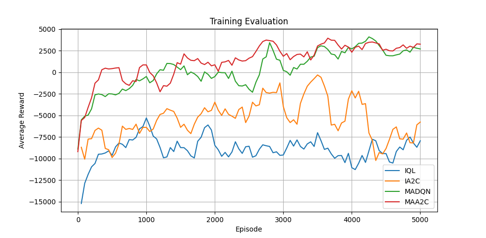

# Multi-Agent Reinforcement Learning for Autonomous Vehicles (Use case: Highway on-Ramp Merging)

Applying multi-agent techniques and approaches to the on-Ramp Merging Scenario, and extended from the single agent reinforcement learning. Mainly value-based deep Q-learning and policy-based Advantage Actor-Critic algorithms.

## Algorithms

All the MARL algorithms are extended from the single-agent RL with parameter sharing and following centralized training with decentralized execution (CTDE) paradigm by using a centralized controller.

- [x] MADQN: independent learning and centralized learning (Currently there is a problem with QMIX network).
- [x] MAA2C: independant and centralized mode.

## Installation
- create an python virtual environment: `conda create -n marl_cav python=3.6 -y`
- active the virtul environment: `conda activate marl_cav`
- install pytorch (torch>=1.2.0): `pip install torch===1.7.0 torchvision===0.8.1 torchaudio===0.7.0 -f https://download.pytorch.org/whl/torch_stable.html`
- install the requirements for MARL: `pip install -r MARL/requirements.txt`
- install SUMO : [sumo docs](https://sumo.dlr.de/docs/Installing/index.html)
- install CARLA : [carla quick start](https://carla.readthedocs.io/en/latest/start_quickstart/)

## Demo
[google drive](https://drive.google.com/drive/u/0/folders/1oGBD8EqlUZay4v8wY3Tlh3AHidBv2_B-)

## Usage
To run the training, just run it via `python run_maa2c.py` or `python run_madqn.py`.
To run the evaluation for existing models, just run it via `python test_env.py`.

## Training curves

     
      Fig.2 Performance comparison between the implemented methods.

